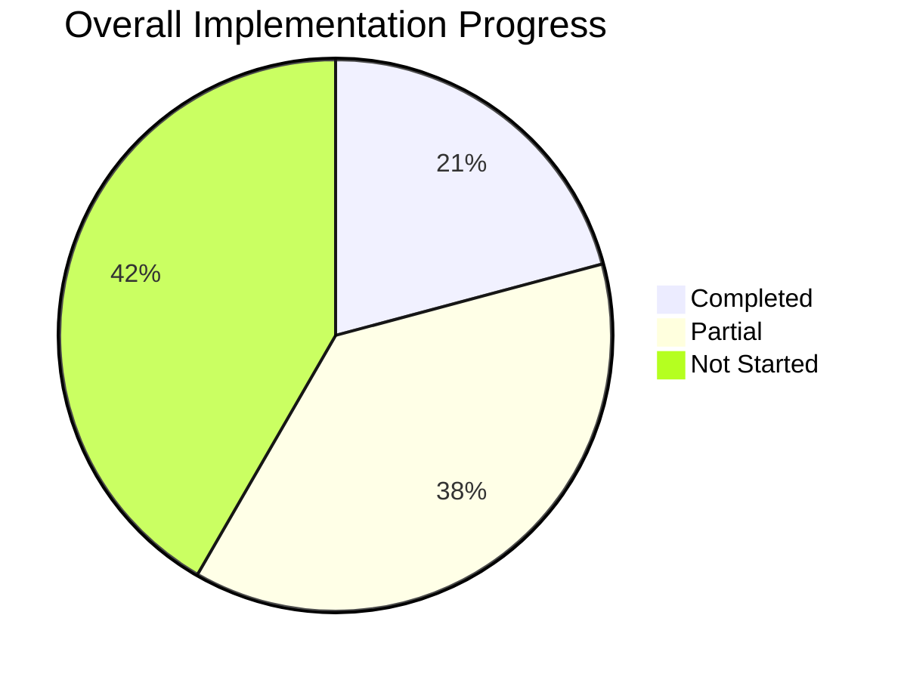
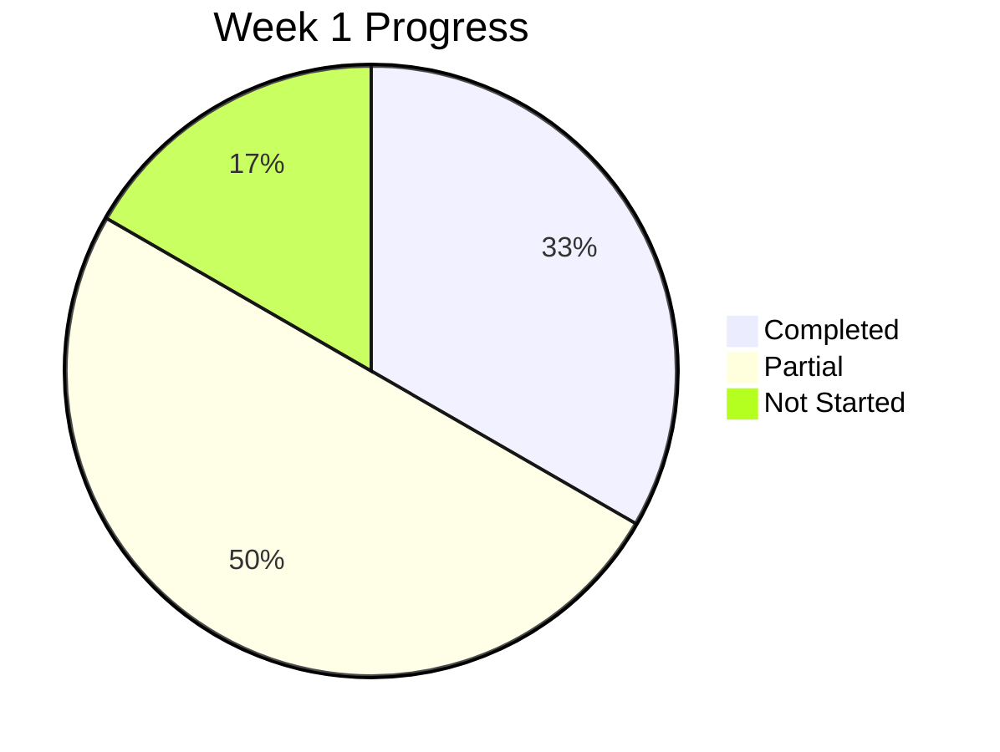
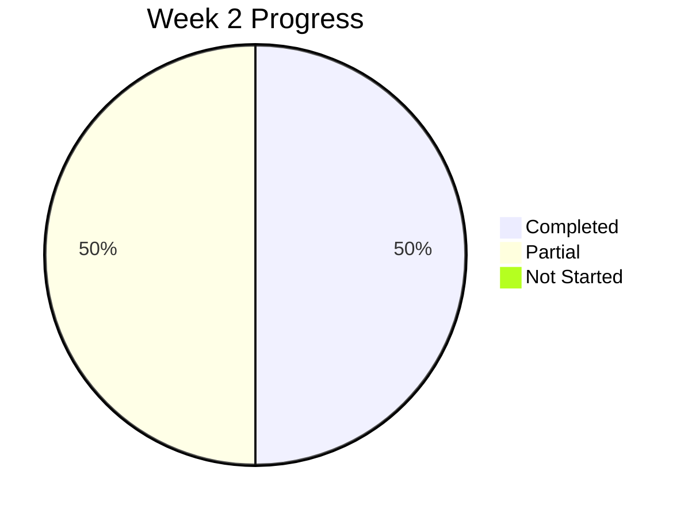
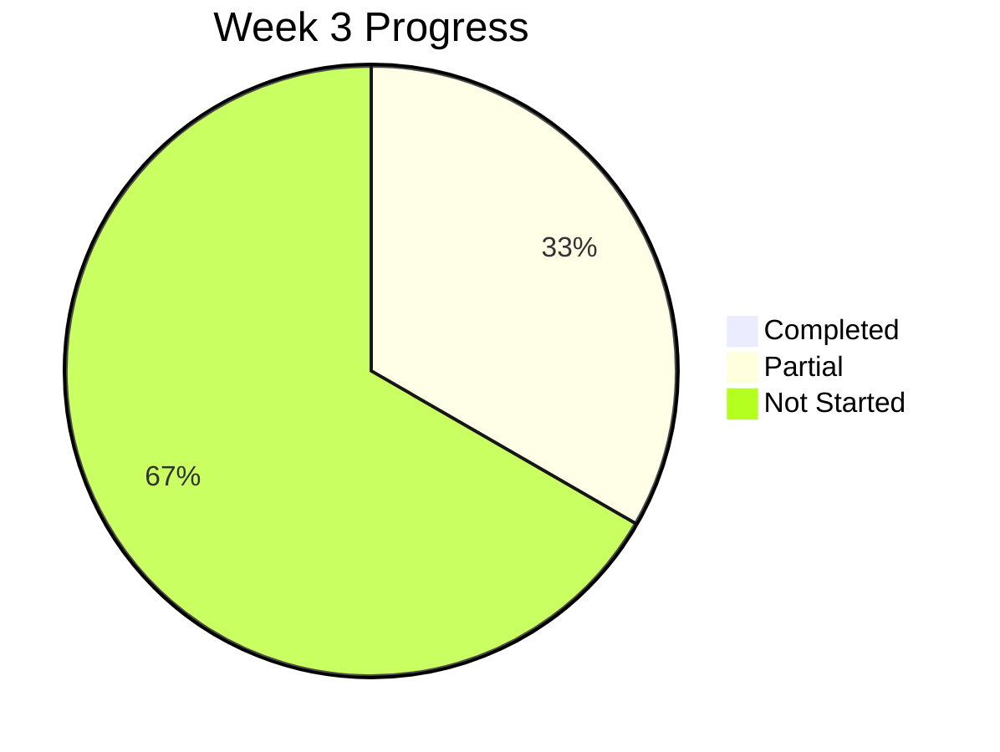

# Food Bank MVP Progress Tracker
**Generated: 2025-04-23**

## Implementation Status Overview

This visual tracker provides a quick overview of the implementation status for all features in the revised MVP plan.

### Legend
- ✅ Completed (100%)
- 🟠 Partial (in progress)
- ❌ Not Implemented (0%)

## Weekly Progress Chart

```mermaid
graph TD
    classDef completed fill:#c6efce,stroke:#006100,color:#006100
    classDef partial fill:#ffeb9c,stroke:#9c5700,color:#9c5700
    classDef notStarted fill:#ffc7ce,stroke:#9c0006,color:#9c0006

    W1[Week 1: Website and Initial Setup]
    W2[Week 2: Volunteer and Inventory Functionalities]
    W3[Week 3: Enhanced User Interaction and Automation]
    W4[Week 4: Data Insights and Advanced Reporting]

    %% Week 1 Features
    W1_1([Set up Website Infrastructure]):::completed
    W1_2([Admin Dashboard]):::partial
    W1_3([Volunteer Dashboard]):::partial
    W1_4([Registration Page]):::completed
    W1_5([Personal Schedule View]):::notStarted
    W1_6([Volunteer-admin Messaging]):::partial

    %% Week 2 Features
    W2_1([Shift Scheduling]):::completed
    W2_2([View Upcoming Shifts]):::partial
    W2_3([Log Incoming Donations]):::completed
    W2_4([Monitor Inventory Levels]):::completed
    W2_5([Shift Editing and Deletion]):::partial
    W2_6([Manual Item Management]):::partial

    %% Week 3 Features
    W3_1([Automated Reminders]):::partial
    W3_2([Feedback Form]):::notStarted
    W3_3([Generate Expiration Alerts]):::partial
    W3_4([Barcode Scanning]):::notStarted
    W3_5([Visual Inventory Reports]):::notStarted
    W3_6([Exportable Inventory Reports]):::notStarted

    %% Week 4 Features
    W4_1([Volunteer Hours Tracking]):::partial
    W4_2([Inventory and Donation Reports]):::partial
    W4_3([Donor Item Preference Lists]):::notStarted
    W4_4([Donor Impact Reports]):::notStarted
    W4_5([Admin Announcements]):::notStarted
    W4_6([Volunteer Dashboard Announcements]):::notStarted

    %% Connections
    W1 --> W1_1
    W1 --> W1_2
    W1 --> W1_3
    W1 --> W1_4
    W1 --> W1_5
    W1 --> W1_6

    W2 --> W2_1
    W2 --> W2_2
    W2 --> W2_3
    W2 --> W2_4
    W2 --> W2_5
    W2 --> W2_6

    W3 --> W3_1
    W3 --> W3_2
    W3 --> W3_3
    W3 --> W3_4
    W3 --> W3_5
    W3 --> W3_6

    W4 --> W4_1
    W4 --> W4_2
    W4 --> W4_3
    W4 --> W4_4
    W4 --> W4_5
    W4 --> W4_6
```

## Implementation Progress by Week

## Immediate Focus Areas

Based on the current implementation status and the revised MVP plan, these are the immediate focus areas:

1. **Complete Core Dashboards** - Both admin and volunteer dashboards need to be implemented
2. **Personal Schedule View** - Create interface for volunteers to view their shifts
3. **Complete Shift Management** - Add functionality for editing and deleting shifts
4. **Enhance Messaging System** - Complete volunteer-admin messaging functionality

## Long-term Focus Areas

These are features that will become priorities once the immediate focus areas are addressed:

1. **Feedback and Reporting Systems** - Implement feedback forms and enhance reporting capabilities
2. **Automation Features** - Add automated reminders and expiration alerts
3. **Advanced Features** - Implement barcode scanning and visual reporting
4. **Donor Management** - Create donor preference lists and impact reports
